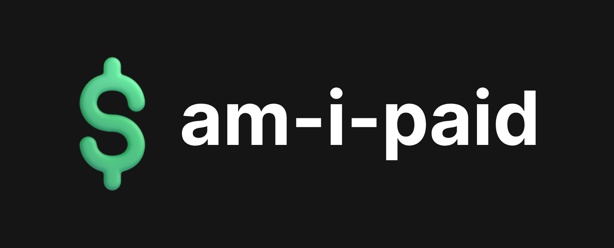

> [!WARNING]
> This API is currently only able to be used by the original author; [Myfer](https://github.com/myferr/)

<p align=center>
  
<br><br>
<br/><a href="https://am-i-paid.vercel.app">https://am-i-paid.vercel.app</a><br/>An API built with SvelteKit and TypeScript to test if my clients have paid me for my work.
</p>

## What does this do?

> [!NOTE]
> The `paid` value is manually inserted by [Myfer](https://github.com/myferr/)

By using the fetch API and fetching `https://am-i-paid.vercel.app/api?client=[clientName]` and replacing `[clientName]` with a name provided in [clients.ts](https://github.com/myferr/am-i-paid/blob/main/src/src/clients.ts) it will return a boolean value named `paid`, which is also provided under a client name in [clients.ts](https://github.com/myferr/am-i-paid/blob/main/src/src/clients.ts)

## Example of Use

In this TypeScript example it checks if the client `Myfer` has paid for their website, if not it logs to the console `No payment!`:

```ts
function blockWebsite() {
  console.log("No payment!");
}

fetch("http://am-i-paid.vercel.app/api?client=Myfer")
  .then((data) => {
    return data.json();
  })
  .then((post) => {
    if (!post.paid) {
      blockWebsite();
    }
  });
```

## Contributing to the project

> Much love to contributors of the project. ❤️🩷

Contribution is always appreciated, pull requests are allowed and might be merged if approved.

To contribute get started by cloning the repository (`git clone https://github.com/myferr/am-i-paid`)
and modifying, adding, or deleting files or code.
